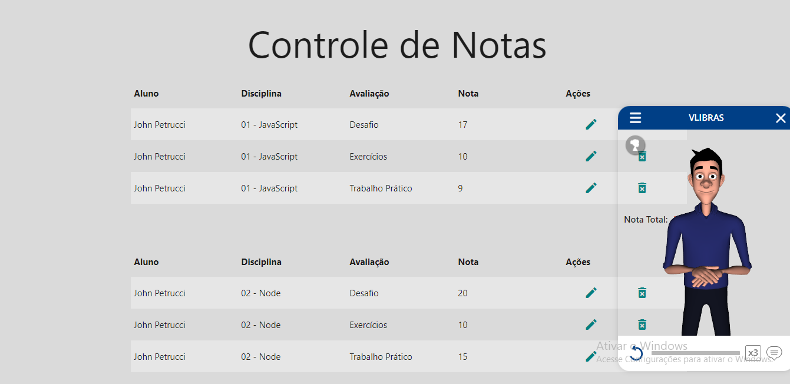

[PT-BR]

# Projeto FullStack Controle de Notas - Bootcamp IGTI Desafio Módulo 3

Professor: Raphael Gomide. 
Aluno: Felipe Marques.

## :memo: Status:

- Concluído.

## :dart: Objetivo:

- Criar Frontend com react para consumir dados do backend simulando grades. 
- Aplicar CRUD na aplicação. 
- Praticar os conceitos de versionamento de código e implantação pelo Heroku. 

## Imagem do Projeto

